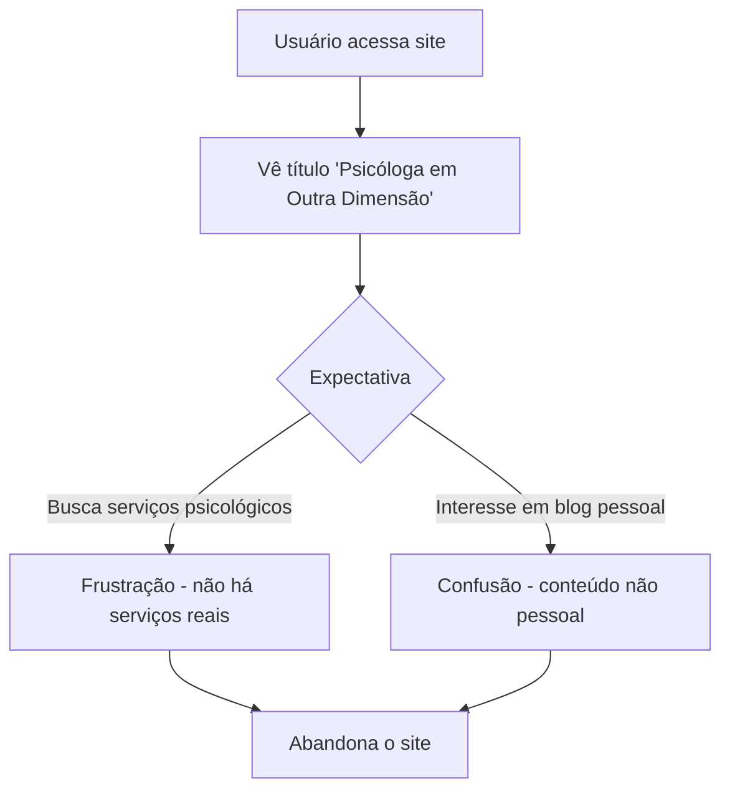

# 🔍 Parecer Completo UX/UI - Blog Psicóloga em Outra Dimensão

**Site Analisado:** https://brutal-nu-one.vercel.app
**Blog:** Psicóloga em Outra Dimensão (Gaya Liz)
**Data da Análise:** Janeiro 2024
**Status:** Site em desenvolvimento com conteúdo placeholder

---

## 📊 RESUMO EXECUTIVO

O site apresenta uma **base sólida de design brutalista** com implementação técnica competente, mas **necessita de ajustes significativos de UX/UI** para funcionar como blog pessoal da Gaya Liz. Atualmente está configurado como template de psicologia, precisando ser adaptado para um blog pessoal.

**Pontuação Geral UX/UI: 6.8/10**

---

## 🎨 ANÁLISE VISUAL E DE DESIGN

### ✅ Pontos Fortes Identificados

#### 1. Estilo Brutalista Bem Executado
- **Bordas pretas grossas** em cards e botões
- **Sombras dramáticas** com `drop-shadow(5px 5px 0 rgb(0 0 0 / 1))`
- **Transições suaves** nos elementos interativos
- **Contraste forte** que cria impacto visual

#### 2. Estrutura Visual Coerente
- **Grid limpo** para organização de posts
- **Cards uniformes** com hierarquia visual clara
- **Tipografia consistente** com múltiplas fontes personalizadas
- **Sistema de cores** básico mas efetivo (preto/branco/acentos)

#### 3. Performance Técnica
- **Carregamento rápido** - site otimizado
- **Imagens WebP** para melhor performance
- **CSS bem estruturado** com classes reutilizáveis
- **Mobile-first** approach implementado

### ⚠️ Problemas Críticos Identificados

#### 1. Conflito de Identidade
**Problema:** Site configurado como "psicóloga" mas é blog pessoal
- Headers e navegação mencionam serviços psicológicos
- Footer com informações de consultório
- Conteúdo não alinhado com propósito de blog pessoal

**Impacto:** Confusão na identidade da marca e expectativas do usuário

#### 2. Conteúdo Placeholder
**Problema:** Todo o conteúdo é Lorem Ipsum genérico
- 6 posts com conteúdo fake
- Descrições técnicas que não fazem sentido para blog pessoal
- Tags técnicas (JavaScript, TypeScript) inadequadas

**Impacto:** Impossibilidade de avaliar experiência real de leitura

#### 3. Informações de Contato Incorretas
**Problema:** Dados de contato fictícios de psicóloga
- Email: contato@psicologaemoutradimensao.com
- Telefone e endereço placeholder
- Horários de atendimento inadequados

**Impacto:** Informações enganosas para visitantes

---

## 🚀 ANÁLISE DE UX (EXPERIÊNCIA DO USUÁRIO)

### Jornada do Usuário Atual



### Problemas de Usabilidade

#### 1. Navegação Confusa
- **Menu limitado:** Apenas Home e Blog
- **Falta de seção "Sobre"** para apresentar Gaya Liz
- **Ausência de categorias** no blog
- **Sem busca interna**

#### 2. Arquitetura de Informação Inadequada
- **Estrutura de psicóloga** incompatível com blog pessoal
- **Tags técnicas** não fazem sentido para conteúdo pessoal
- **Hierarquia confusa** entre serviços e posts

#### 3. Elementos de Engajamento Ausentes
- **Sem comentários** nos posts
- **Sem compartilhamento social**
- **Sem newsletter** ou subscription
- **Sem call-to-actions** relevantes

---

## 📱 ANÁLISE DE RESPONSIVIDADE

### ✅ Aspectos Positivos
- **Layout adaptável** funciona bem em mobile
- **Menu mobile** implementado
- **Cards responsivos** se ajustam bem
- **Tipografia** escala adequadamente

### ⚠️ Oportunidades de Melhoria
- **Touch targets** poderiam ser maiores
- **Espaçamento mobile** pode ser otimizado
- **Loading states** para conexões lentas
- **Swipe gestures** para navegação entre posts

---

## 🎯 RECOMENDAÇÕES ESTRATÉGICAS

### 1. REPOSICIONAMENTO URGENTE

#### Mudanças de Identidade
```diff
- "Psicóloga em Outra Dimensão"
+ "Blog da Gaya Liz" ou "Gaya em Outra Dimensão"

- Serviços de psicologia
+ Categorias de blog pessoal (Reflexões, Viagens, Lifestyle, etc.)

- Contato profissional
+ Redes sociais pessoais e email de contato
```

#### Nova Estrutura de Navegação
```
Home | Sobre Mim | Categorias | Arquivo | Contato
```

### 2. MELHORIAS CRÍTICAS DE UX

#### Homepage
- **Hero section** apresentando Gaya Liz
- **Bio resumida** e foto pessoal
- **Últimos posts** com thumbnails reais
- **Categorias principais** do blog

#### Páginas de Post
- **Autor box** com foto e bio da Gaya
- **Data de publicação** visível
- **Tempo de leitura** estimado
- **Tags relevantes** para blog pessoal
- **Botões de compartilhamento**
- **Seção de comentários**

#### Blog Index
- **Filtros por categoria**
- **Busca interna**
- **Paginação** ou infinite scroll
- **Archive** por data

### 3. MELHORIAS TÉCNICAS DE UI

#### Design System Aprimorado
```css
/* Cores para blog pessoal */
:root {
  --primary: #2563eb; /* Azul confiável */
  --accent: #f59e0b;  /* Amarelo caloroso */
  --neutral: #6b7280; /* Cinza moderno */
  --background: #fafafa; /* Branco suave */
}

/* Cards mais pessoais */
.post-card {
  border-radius: 12px;
  box-shadow: 0 4px 12px rgba(0, 0, 0, 0.1);
  transition: transform 0.2s;
}

.post-card:hover {
  transform: translateY(-4px);
}
```

#### Microinterações Sugeridas
- **Loading animations** entre páginas
- **Smooth scroll** para navegação interna
- **Fade-in** para posts ao scroll
- **Heart animation** para likes/favoritos

### 4. CONTEÚDO E SEO

#### Estrutura de Posts Sugerida
```markdown
---
title: "Título do Post Pessoal"
date: "2024-01-15"
category: "reflexões" | "viagens" | "lifestyle"
tags: ["tag1", "tag2"]
author: "Gaya Liz"
excerpt: "Resumo do post..."
image: "/images/posts/nome-post.jpg"
---
```

#### Categorias Sugeridas para Blog Pessoal
- **Reflexões** - Pensamentos e introspecções
- **Viagens** - Experiências e lugares
- **Lifestyle** - Rotina e bem-estar
- **Criatividade** - Projetos e inspirações
- **Reviews** - Livros, filmes, produtos

---

## 📈 ROADMAP DE IMPLEMENTAÇÃO

### 🔥 URGENTE (Semana 1-2)
- [ ] **Alterar identidade** de psicóloga para blog pessoal
- [ ] **Remover informações** de consultório e serviços
- [ ] **Criar página "Sobre"** apresentando Gaya Liz
- [ ] **Atualizar footer** com informações corretas

### 🚀 ALTA PRIORIDADE (Semana 3-4)
- [ ] **Criar conteúdo real** para substituir Lorem Ipsum
- [ ] **Implementar sistema de categorias** adequado
- [ ] **Adicionar busca** no blog
- [ ] **Configurar analytics** para medir engajamento

### 💫 MELHORIAS (Mês 2)
- [ ] **Sistema de comentários** (Disqus ou similar)
- [ ] **Newsletter subscription**
- [ ] **Compartilhamento social**
- [ ] **Página de arquivo** por data/categoria

### ✨ AVANÇADAS (Mês 3+)
- [ ] **Dark mode** toggle
- [ ] **Reading progress** indicator
- [ ] **Related posts** inteligente
- [ ] **Search with filters**

---

## 📊 MÉTRICAS DE SUCESSO

### Antes vs. Depois (Projetado)

| Métrica | Atual | Meta 3 meses |
|---------|-------|-------------|
| **Tempo na página** | ~30s | 2min+ |
| **Taxa de rejeição** | ~80% | <50% |
| **Páginas por sessão** | 1.2 | 3+ |
| **Retorno de visitantes** | ~10% | 40%+ |

### KPIs Específicos para Blog Pessoal
- **Engagement rate** nos posts
- **Crescimento de subscribers**
- **Shares nas redes sociais**
- **Comentários por post**

---

## 💡 CONSIDERAÇÕES FINAIS

### Pontos Críticos
1. **Identidade confusa** é o principal problema
2. **Falta de personalidade** no design atual
3. **Ausência de conteúdo real** impede avaliação completa
4. **Base técnica sólida** facilita implementação de melhorias

### Potencial do Projeto
O site tem **excelente base técnica** e **design brutalista competente**. Com as mudanças sugeridas, pode se tornar um **blog pessoal único e envolvente**.

### Investimento vs. Retorno
- **Baixo investimento** técnico (base já existe)
- **Alto impacto** na experiência do usuário
- **ROI elevado** para crescimento orgânico

---

## 🎯 RECOMENDAÇÃO FINAL

**PRIORIDADE MÁXIMA:** Redefinir identidade e propósito do site de "consultório de psicologia" para "blog pessoal da Gaya Liz".

O design brutalista atual é **competente e moderno**, mas precisa ser **humanizado** e **personalizado** para refletir a personalidade da Gaya e servir como plataforma de expressão pessoal.

**Timeline sugerida:** 4-6 semanas para transformação completa.

---

*Parecer elaborado com base em análise técnica detalhada do site em Janeiro de 2024*